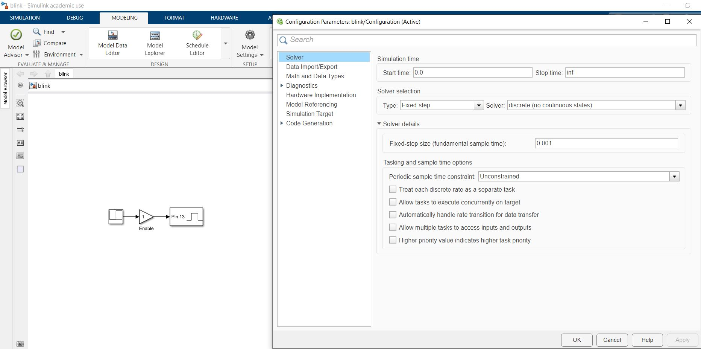
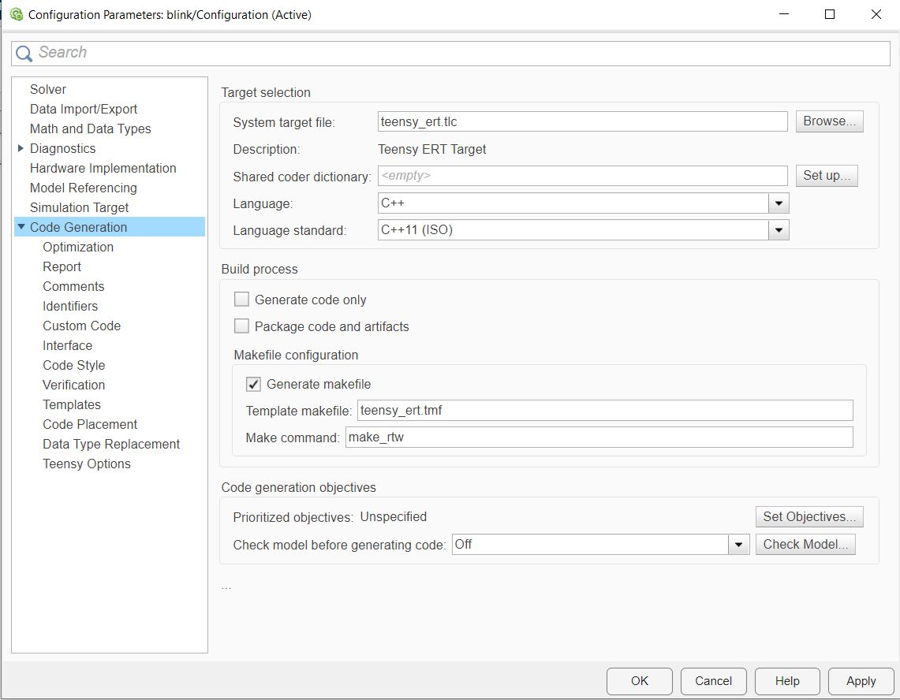
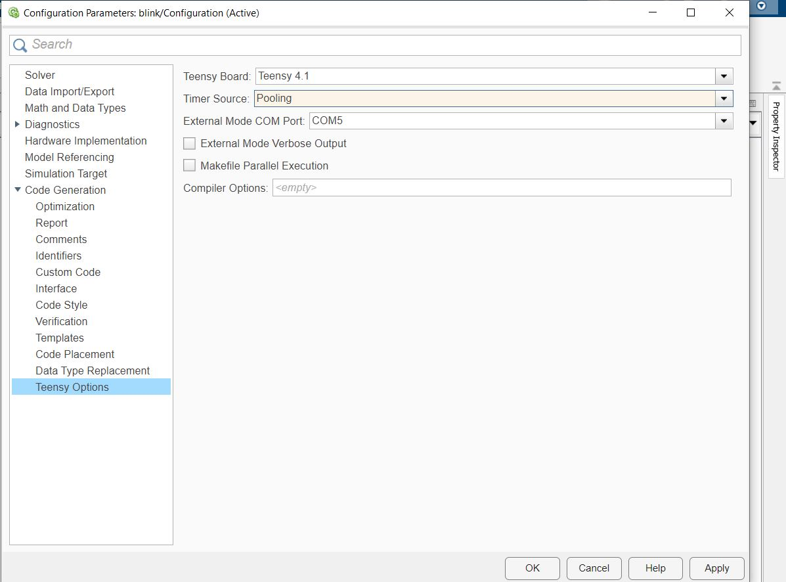
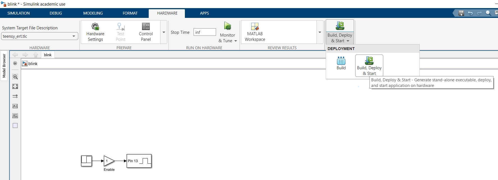
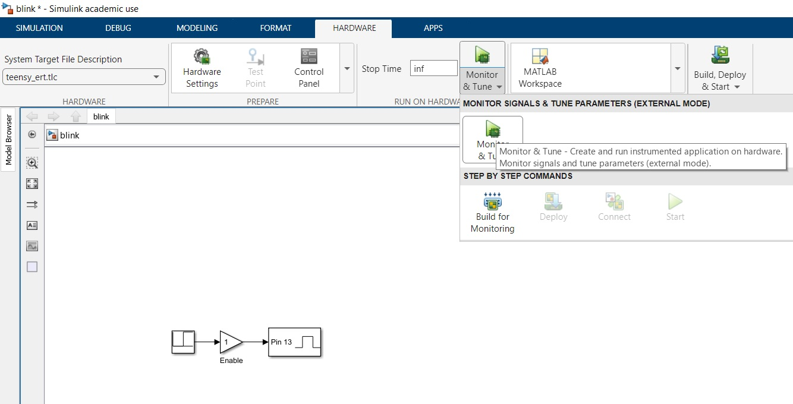
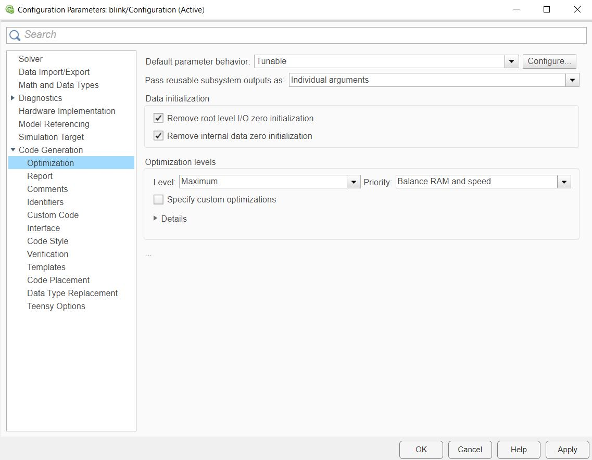

# Embedded Coder Target for Teensy

The Embedded Coder Target for Teensy provides a library to use Teensy 3.X and 4.X boards with code generated from Simulink, using the Embedded coder. The library provides the typical blocks for input & output and other utilities.
The library is built upon the [Embedded Coder Target for Arduino](https://it.mathworks.com/matlabcentral/fileexchange/30277-embedded-coder-target-for-arduino).

The library implements both standalone and external mode execution. However, Processor-In-the-Loop (PIL) and Software-In-the-Loop (SIL) are not available.

Author: Stefano Lovato (<a href="mailto:stefano.lovato.1@phd.unipd.it">stefano.lovato.1@phd.unipd.it</a>)

Year: 2023

## Requirements

Requirements are:

* MATLAB with MATLAB Coder
* Simulink with Simulink Coder and Embedded Coder
* Windows (>=10)

## Installation

To install the Embedded Coder Target for Teensy, you need to:

* Place the library folder in a stable path without spaces
* Open MATLAB, go to the library folder and run "setup_teensy_target.m". This script adds the library folder to the MATLAB path and set the development environment.

## Getting Started

The steps for getting started with the library are:

* Create a new Simulink (blank) model and save it
* Go to solver and set the stop time to "inf", the Solver type to "Fixed-step" with "Discrete (no continous states)
  
* In Solver details set the fixed-step size as you need
* Go to Modeling > Model Settings > Code Generation and select "Teensy_ert.tlc" as the System target file  
  
* Go to Teensy Options and configure the settings according to your hardware 
  
* Go in App and select "Run on Custom Hardware". A new toolstrip "Hardware" will appear.
* Built your model using the library blocks
* Click on "Build, Deploy & Start" to build and deploy the standalone application on the hardware, or on "Minotor & Tune"" to run the external mode.

You may also look at "./demos" for examples.

## Execution modes

 Two execution modes are available:

* Standalone execution
* External mode for monitor and tuning the application

### Standalone execution

In the standalone execution the model is compiled and uploaded to the board "as is", i.e. the only task performed during the execution is the model step and no external communications with the host PC take place (except for those specified in the model). This execution mode is the preferred one for the final deployment of the application on the target hardware.

To build the application for the standalone execution click on "Build, Deploy & Start" button in the Hardware toolstrip.

### External mode

In the external mode the model is compiled and uploaded to the board, together with a communication protocol to interface the host PC with the target board using the USB-Serial interface. 
During the exection the tasks performed are the model step and the external communication with the host PC, which allows to monitor the application signals and tune the tunable parameter in runtime. This execution mode is the preferred one for testing and debugging.

To build the application for the external mode click on "Monitor & Tune" button in button in the Hardware toolstrip. In addition, you may change the "Default parameter behaviour" to "Tunable" in Modeling > Model Settings > Code Generation > Optimization, in order to make the parameter tuning available (when possible).

Note that when building the application in external mode, the Dual Serial is employed, i.e. two COM ports will be visible, with typically the second one dedicated for the external mode communication. Therefore the usb-serial blocks works also with the external mode enabled.

## Teensy Options

In Modeling > Model Settings > Code Generation > Teensy Options you can select options for the building and execution.

### Teensy Board

Possible Teensy boards are:

* Teensy 4.1
* Teensy 4.0 (Not tested)
* Teensy 3.6 (Not tested)
* Teensy 3.5 (Not tested)
* Teensy 3.2 (Not tested)

### Timer Source

The timing of the task can be provided by:

* Software timer (Pooling method)
* Hardare interrupt timer (Interval Timer method)

### External Mode COM Port

To use the external mode, you need to configure this option according to the COM port assigned to your Teensy board with the Dual Serial enabled. Available COM ports are from COM0 to COM10 (if necessary, you can use the Windows Device Manager to assign one of this COM port to the board).

To identify the COM port employed with the Dual Serial enabled, run the model in external mode and after the model has been deployed on the target hardware, run in MATLAB " serialportlist("available")". This show you the available serial (COM) ports: you need to identify which of them is the one dedicated for the external mode by try and error.

### External Mode Verbose Output

Use this checkbox to show detailed information during the external mode execution.

### Makefile Parallel Execution

Use this checkbox to build the model using multiple processors.

### Compiler Options

Add here additional compiler options (for advanced usage). Keep it empty by default.

## Implemented Simulink Blocks

Implemented Simulink Blocks include:

* Digital read
* Digitial write
* Analog read & Analog Resolution
* PWM Output & PWM Resolution
* Serial config, write & read
* CPU Temp read
* Millis & Micros
* Clock (in seconds)
* Overrun counter

The following blocks are not implemented yet:

* I2C begin, write & read
* SD file open, write & close
* Interrupt counters
* Serial read bytes (w/ fixed number of bytes)

## TODO list 

* Implement Serial read bytes block
* Implement Interrupt block
* Implement I2C begin, write, & read
* Example of implementation of write & read sensors: using library vs. using I2C blocks
